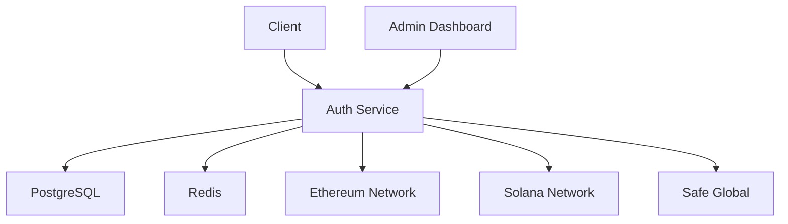

# SIWE Auth Microservice

## 1. Project Overview

### Purpose
This microservice provides a comprehensive authentication solution for the Giveth ecosystem, supporting both Ethereum (SIWE) and Solana wallet-based authentication. It serves as a centralized authentication service for all Giveth Dapps.

### Key Features
- Multi-chain wallet authentication (Ethereum and Solana)
- Session management with JWT tokens
- Secure message signing and verification
- Integration with Safe Global for multi-sig support
- Admin dashboard for user management
- Rate limiting and security features

### Live Links
[Add production/staging URLs once available]

## 2. Architecture Overview

### System Diagram


### Tech Stack
- Node.js
- Express.js
- TypeScript
- PostgreSQL (primary database)
- Redis (session storage and rate limiting)
- TypeORM (database ORM)
- AdminJS (admin dashboard)
- SIWE (Sign-In with Ethereum)
- Safe Global Protocol Kit
- Solana Web3.js

### Data Flow
1. User initiates sign-in with their wallet (Ethereum or Solana)
2. Service generates authentication message
3. User signs message with their wallet
4. Service verifies signature and creates session
5. JWT token issued for subsequent requests
6. Session data stored in Redis
7. User data persisted in PostgreSQL

## 3. Getting Started

### Prerequisites
- Node.js (v16 or higher)
- PostgreSQL (v12 or higher)
- Redis (v6 or higher)
- Git
- Docker and Docker Compose (optional)

### Installation Steps
1. Clone the repository:
```bash
git clone [repository-url]
```

2. Install dependencies:
```bash
npm install
```

3. Create `.env` file with required environment variables:
```env
PORT=3000
POSTGRES_HOST=localhost
POSTGRES_PORT=5432
POSTGRES_USER=postgres
POSTGRES_PASSWORD=your_password
POSTGRES_DB=siwe_auth
REDIS_HOST=localhost
REDIS_PORT=6379
JWT_SECRET=your_jwt_secret
ADMIN_EMAIL=admin@example.com
ADMIN_PASSWORD=your_admin_password
```

### Database Setup

1. **Using Docker Compose (Recommended)**
   ```bash
   docker-compose -f docker-compose-local-postgres-redis.yml up -d
   ```

2. **Manual Setup**
   - Install PostgreSQL and Redis
   - Create database and user
   - Configure connection settings

### Database Management

#### Migrations
We use TypeORM for database migrations.

1. **Create a new migration**
   ```bash
   npm run migration:create <migration-name>
   ```

2. **Run migrations**
   ```bash
   # Development
   npm run db:migrate:run:local

   # Staging
   npm run db:migrate:run:staging

   # Production
   npm run db:migrate:run:production
   ```

3. **Revert migrations**
   ```bash
   npm run db:migrate:revert:local
   ```

## 4. Usage Instructions

### Running the Application

Development mode:
```bash
npm start
```

Production mode:
```bash
npm run build
npm run start:server:production
```

### Testing
Run tests:
```bash
# All tests
npm test

# Specific test files
npm run test:applicationRepository
npm run test:organizationRepository
npm run test:tokenRouter
npm run test:donationRouter
```

### API Documentation
The API documentation is available at `/api-docs` when the server is running. It's automatically generated using TSOA.

## 5. Deployment Process

### Environments
- Development: Local development environment
- Staging: [Add staging environment details]
- Production: [Add production environment details]

### Deployment Steps
1. Build the application:
   ```bash
   npm run build
   ```

2. Run database migrations:
   ```bash
   npm run db:migrate:run:production
   ```

3. Start the server:
   ```bash
   npm run start:server:production
   ```

### CI/CD Integration
[Add details about CI/CD pipeline once implemented]

## 6. Troubleshooting

### Common Issues
1. **Database Connection Issues**
   - Verify PostgreSQL connection settings
   - Check network connectivity
   - Ensure correct environment variables are set

2. **Redis Connection Issues**
   - Verify Redis connection settings
   - Check Redis server status
   - Ensure correct environment variables are set

3. **Authentication Failures**
   - Verify wallet connection
   - Check message signing process
   - Validate nonce generation and verification

### Logs and Debugging
- Application logs are written to `logs/` directory
- Use environment variable `DEBUG=true` for verbose logging
- Monitor PostgreSQL and Redis logs for database-related issues

## Contributing
[Add contribution guidelines]

## License
ISC
